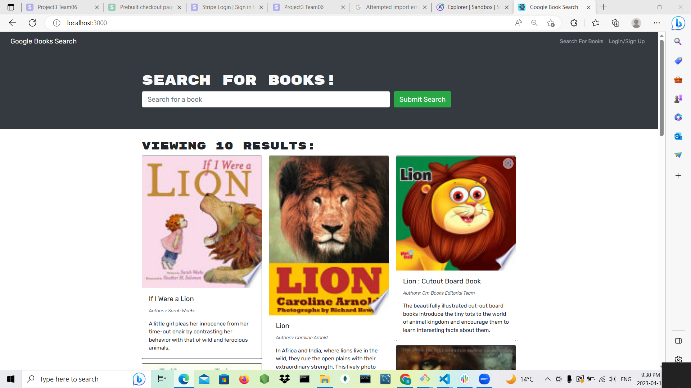

# 21 MERN: Book Search Engine

The goal of the assignment is to convert given starter code from RESTful API to GraphQL API built with Apollo Server. Server. The app was built using the MERN stack with a React front end, MongoDB database, and Node.js/Express.js server and API. It's already set up to allow users to save book searches to the back end.

## Installed Packages

Apoll-Server-Express,

Apollo-client,

Bootstrap,

GraphQL,

React,

React-Router,

React-Router-Dom,

Mongoose,

Bcrypt

## Generated images

## URL of the GitHub repository

## URL of the GitHub repository

https://github.com/Bamidele100/book-search-engine.git

## walkthrough video

https://drive.google.com/file/d/1Kf0HqLIszeqTIzT1VPfwR7T8OSZ-gDUa/view